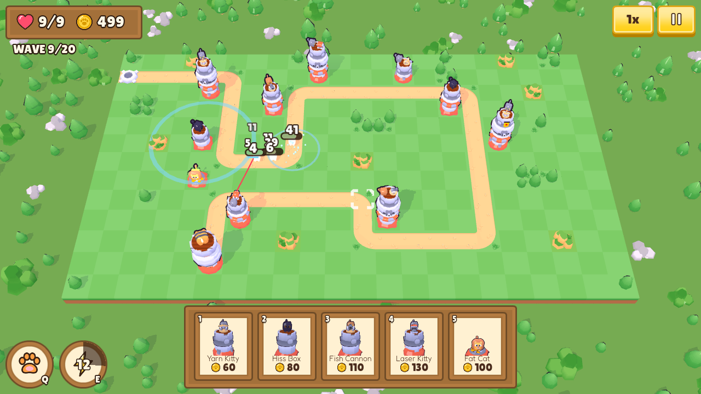
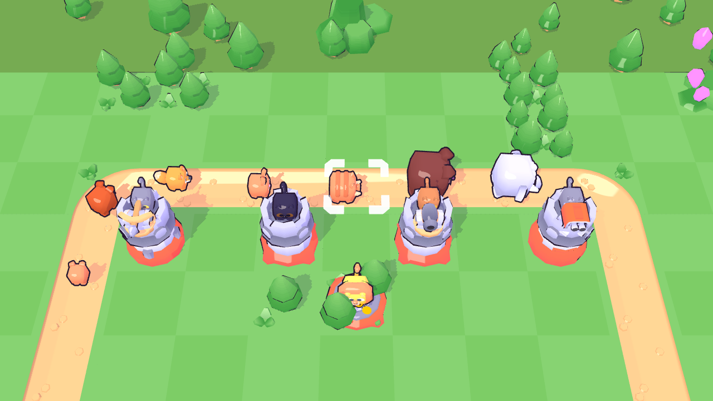

# Tower Tiles: Nine Lives 🐱🏰

*A cozy-chaotic 3D tower defense game in **Godot 4.7**, built for the web.*

Your cat lives at the top of a tower. The neighborhood pack wants in. Build a squad of kittens along the road, upgrade them, grab perks between waves, and keep all nine lives.




## How to play

| Action | Mouse / touch | Keys |
| --- | --- | --- |
| Pick a kitten to build | Click a card in the bottom bar | `1`–`5` |
| Place it | Click a grass tile (tap twice on touch) | Hold `Shift` to keep placing |
| Select / upgrade / sell | Click a kitten | `U` upgrade · `X` sell · `T` target mode |
| Start the next wave early (bonus gold) | **Start Wave** button | `Space` |
| Giant Paw Slam | Paw button, then click the road | `Q` |
| Zoomies (2× attack speed) | Lightning button | `E` |
| Game speed 1×/2×/3× | Speed button | `F` |
| Pan / zoom | Right-drag · mouse wheel · pinch | `WASD` / arrows |
| Pause | Pause button | `Esc` |

### Kittens
| Kitten | Role |
| --- | --- |
| **Yarn Kitty** | Cheap, reliable single-target damage from a tiny ballista. Max level throws two yarn balls. |
| **Hiss Box** | A spooky black cat that hisses in a ring, slowing every critter nearby. Max level stuns. |
| **Fish Cannon** | Lobs real (cartoon) fish that splash a whole group. |
| **Laser Kitty** | Locks on to one critter; damage ramps up the longer it stares. Max level chains. |
| **Fat Cat** | A lion napping on a pile of coins who pays out gold after every wave. |

Every kitten has 4 levels (its tower grows, max level gets a golden flag), targeting modes (First / Last / Strong / Close) and sells back for 70%.

### The pack
Pups (weak), Hounds, Foxes (very fast), Boars (armored, cost 2 lives), Nurse Bunnies (heal their friends), and two bosses: the **Alpha Hound** (howls to speed up the pack) and **Big Ellie** the elephant (stomps and jams nearby kittens).

### Upgrades: three layers
1. **In-run:** level kittens up with gold.
2. **Purr-ks:** every 3 waves, pick 1 of 3 roguelite perks (Sharp Claws, Catfeine, Lucky Whiskers crits, Yarn Storm, Hoarder interest…). They stack.
3. **The Cat Tree (meta):** surviving waves earns 🐟 fish, which buy permanent upgrades on the main menu (starting gold, extra lives, damage, paw power, cooldowns, perk rerolls…). Refundable anytime.

Three hand-made maps unlock in order (The Backyard → Garden Maze → The Dog Park), and **Wild Meadow** generates a brand-new winding road, trees and rocks every time you pick it (the map-select card previews the exact layout; Restart keeps it). Each run is 20 waves with a boss every 5; clear it to earn up to ★★★ (no lives lost), then keep going in **Endless Mode**.

## Look
- **Models:** Kenney's *Cube Pets* (animated cat, tiger, lion, dog, fox, boar, bunny, elephant, fish) and *Tower Defense Kit* (tiles, towers, weapons, trees), all CC0. Road tiles are picked and rotated automatically from each ASCII map.
- **Toon shader** (`shaders/toon_common.gdshaderinc`): two crisp light bands with coloured (lilac) shadows, a soft rim light and a toon highlight. It runs on the Compatibility renderer, so the web build looks the same as desktop.
- **Outlines** (`shaders/outline.gdshader`): inverted hulls with a constant on-screen width, built from smoothed normals so cube-shaped models don't crack at the corners.
- **UI:** Kenney *UI Pack* and *UI Pack Adventure* (parchment panels, wood plates, ribbons, chunky buttons), **Lilita One** for titles and numbers, **Fredoka** for body text, hand-made SVG icons, and live 3D portraits of every kitten and critter on the cards.

## Juice
Screen shake with trauma falloff, hit-stop on big moments, white hit-flash, squash-and-stretch on everything, bouncing critters that get *bonked* off the map, floating damage numbers and crits, kill combos, coins that fly into your gold counter, wave banners, cat reactions (puffing up, hissing, happy hops), a giant paw from the sky, a cat-eye iris transition, procedurally generated sound effects and music, and a live battle running behind the main menu.

## Web build & performance
- **Compatibility renderer** (WebGL 2) and a **single-threaded** export, so it runs on itch.io or GitHub Pages with no special server headers.
- Every tile type, tree and rock on the board is a single `MultiMesh` (one draw call per type, plus one for its outline).
- No per-instance shader uniforms (they render black on some WebGL 2 drivers); hit flashes swap in a shared material for a few frames instead.
- Health bars, damage numbers and flying coins are drawn by **one** 2D canvas item instead of hundreds of nodes.
- Particles and effect rings are pooled; nothing is allocated mid-fight.
- The game's own data is about **1.5 MB** (models, UI art, two fonts, sound and music). A low-quality mode (no shadows or outlines, 75% 3D resolution) is picked automatically on mobile browsers and can be toggled in Settings.

### Export it yourself
1. Install **Godot 4.7.2** and its export templates.
2. *Project → Export → Web → Export Project* (outputs to `build/web/`).
3. Serve the folder with any static web server, or upload it to itch.io as an HTML5 game.

### Auto-deploy to GitHub Pages
`.github/workflows/deploy-web.yml` builds the web export on every push to `main`. To turn it on, go to **Settings → Pages → Source: GitHub Actions**. The game will be at `https://<user>.github.io/<repo>/`.

## Project layout
```
autoload/   Save (progress + settings), Sfx (pooled audio + music), Transition (iris wipe),
            Portraits (renders 3D portraits for the UI)
game/       game.gd (the run), level, enemy, turret, projectile, pet_rig (animated Cube Pets),
            cat_tower, toon (toon/outline helpers), fx, overlay, camera
            game_data.gd holds every number: kittens, critters, perks, meta upgrades, maps, waves
ui/         HUD, UI kit (theme + helpers), cooldown dial, settings panel
shaders/    toon + outline shaders
assets/     models/ (Kenney), ui/ (Kenney + SVG icons), fonts/
scenes/     main_menu + game scenes
audio/      generated sfx (.wav) and music (.ogg)
tools/      gen_audio.py: regenerates all audio (python3 + numpy + ffmpeg)
```

### Add a map
Procedural maps come from `game/map_gen.gd` (a random self-avoiding walk on a coarse lattice, so the road can never touch itself). Hand-made maps:
Add an entry to `GameData.MAPS`: an ASCII grid where `.` is buildable grass, `#` is road, `S` is the critters' burrow, `C` is your cat's tower, and `T`/`R` are trees and rocks. Roads must not touch sideways.

### Rebalance
All tuning lives in `game/game_data.gd`: kitten stats per level, critter stats, `hp_mult()` (wave scaling), `build_wave()` (wave composition), perks and meta costs.

## Credits
- 3D models and UI art: [Kenney](https://kenney.nl) (Cube Pets, Tower Defense Kit, UI Pack, UI Pack Adventure), CC0. The Tower Defense Kit palette was recoloured to a warmer garden green.
- Fonts: [Lilita One](https://fonts.google.com/specimen/Lilita+One) and [Fredoka](https://fonts.google.com/specimen/Fredoka), SIL Open Font License (see `assets/fonts/`).
- Icons, sound effects and music: made for this project (`assets/ui/icons/`, `tools/gen_audio.py`).
